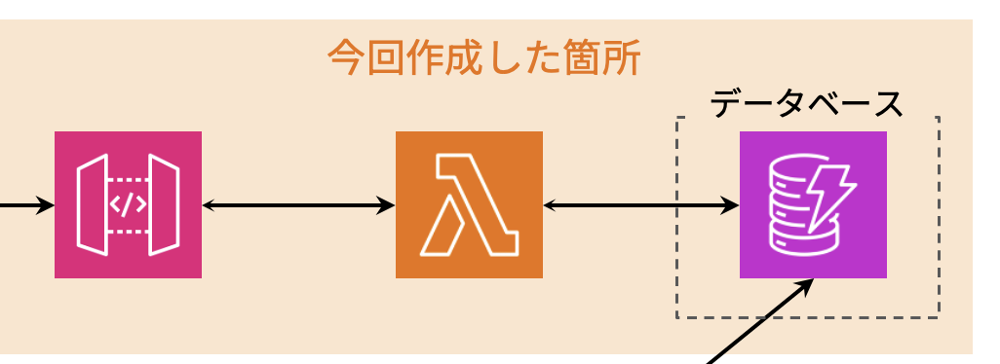

# done
・AWSサーバーレス勉強会　ハンズオン
1.AWSアカウント登録、セキュリティ設定
2.DynamoDB作成(パーティション、ソートキー指定)
3.IAMロールの作成,Lamdaにアタッチ
4.Lamdaの作成(DynamoDBからデータを呼び出して戻り値はAPI Gatewayに渡す。)
・index.mjs/.jsのhandlerメソッドが実行される

5.APIGatewayの作成、デプロイ
6.リソースの削除

# report
・AWSサーバーレスの利点：サーバーの管理が不要。SQLのバージョン管理不要。自動的にスケーリング。
・API Gateway:APIを整理、入出力を管理。APIへリクエストが送られた際、Lamdaなどを実行する。
・DynamoDB:すぐに呼び出したい場合に使う。
・Lamda:コンピューティングサービス。プログラム（？）を実行可能。
・IAMロール：１サービスにつける。
APIGateway
・CORSを有効にする：グループ内でのみ利用したいときチェック
・統合タイプ：Lamdaと連携したいときはLamdaにチェック
・Lamdaプロキシ統合の使用：APIGatewayのデータの受け渡し方。Lamdaプロキシ統合を使用するとAWSのデフォルトの設定方法。
・ステージ：開発環境
S3
・データ保管の他にフロントエンドのAppも置ける
CloudFront
・アクセス集中を防ぐ。リクエストに応じてスケールしてくれるので大量のリクエストも捌ける。
CloudWatch
・運用時のログ。トラフィック履歴
AWS CDK
・実際の開発では、ブラウザからデプロイはせずに、ローカルPCからコードで行う。
・Amplifyと似てる。WEB開発に特化したツール
・AWSリソースへの接続はモック化するか、AWS SAMをつかってローカルから接続する。
・