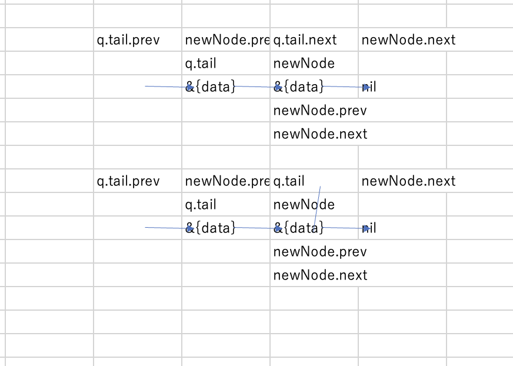

# done
・Recursion 上級　キュー　8時間 

# report

・昨日以下のように書いたが、慣れ＝学習項目の理解。加えてその理解した事柄に仮定を妥当なように当てはめることだとおもった。
>効率的でない方法をイメージできる必要があるぶん効率的な方法としてのスタックは難しいのかもしれん。アプローチがスタック使うことで変わる場合と変わらん場合がある。変わらん場合は思いつくのは難しくないが、変わる場合は慣れる必要がある。 

・スタックを長考したおかげでキューを比較的簡単にコーディングに適用できた。 

https://recursionist.io/dashboard/problems/274

・双方向リストのノードの処理で迷ったので以下メモ　
https://recursionist.io/dashboard/problems/415
ノード繋ぐ時、ノード繋いだ後
左辺　＝　設定、更新の対象　右辺　＝　設定、更新の値
値があるかどうか
スコープの内側だから同じ値を別の２つの変数が示すことになっているがグローバルスコープはq.tail、q.headのみ

更新したいのは、q.tail.nextとnewNode.prev、q.tail、newNode.nextはnilなので初期値でよい。
最初にq.tailを指標にノードを繋いで、繋いだ後に,q.tailを更新する。

・久々に体調が悪い。頭痛がひどいので早めに寝る。