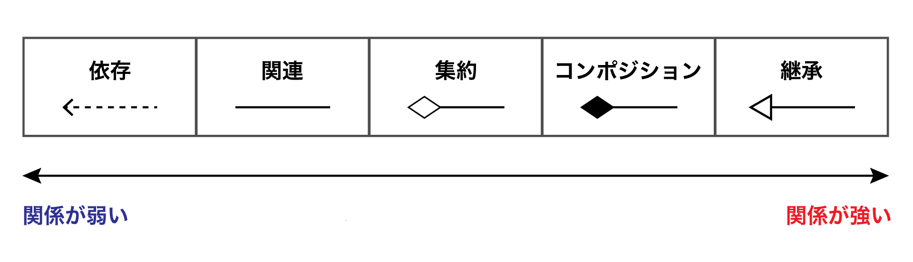

# りアクト（言語環境編）
## 継承よりも合成のスタイルが優勢(p.171)
2010年代以降に登場したGo,Rustでは継承が存在しない。　
継承を避けるべきという認識が開発者の間に広がっている。
### Rectangleクラス
```ts
class Rectangle {
readonly name = 'rectangle'; sideA: number;
sideB: number;
constructor(sideA: number, sideB: number) { this.sideA = sideA;
this.sideB = sideB;
}
getArea = () => this.sideA * this.sideB; }
```


### 継承
```ts
class Square extends Rectangle {
readonly name = 'square'; side: number;
constructor(side: number) { super(side, side);
} }
```

DRY(Don't Repeat Yourself)に従っている
・抽象化が高い
・コード量が少ない

しかし、保守性が低い
・不要な公開プロパティsideAとsideBも継承して、バグの元になるリスクがある。
・getArea()メソッドが親と子で共有しているので、親クラスの実装を不用意に変更できない。
・親クラスと子クラスの責任の境界が曖昧で、設計しづらい
・不具合の原因を突き止めにくい
・Rectangleクラスのnameフィールド宣言からreadonly修飾子を削除する必要がある

### 合成
```ts
class Square {
readonly name = 'square'; side: number;
constructor(side: number) { this.side = side;
}
getArea = () => new Rectangle(this.side, this.side).getArea(); }
```

モジュールの独立性が高く、保守性に優れている。
・親クラスとの依存関係がなくそれぞれ独立しているため、親クラス内部の実装を知らなくても子クラスを実装できる。

# 詳解Go言語Webアプリケーション開発
## 埋め込みは継承か？（p.63,65）
### Java(従来のオブジェクト指向言語)
```java
class Person {
    String name;
    int age;
}

// Person クラスを継承したJapaneseクラス
class Japanese extends Person {
    int myNumber;
}

class Main {
    // Person クラスを引数にとるメソッド
    public static void hello(Person p) {
        System.out.println("Hello " + p.name);
    }

    public static void main(String[] args) {
        Japanese japanese = new Japanese();
        japanese.name = "budougumi0617";
        Person person = japanese; //(1)
        Main.hello(japanese); //(2)
    }
}
```

・（1）JavaではPersonクラスを継承したJapaneseクラスのオブジェクトは、多態性によりPerson変数に代入できる。
・(2)Personクラスのオブジェクトを引数にとるメソッドへも代入できる。

### Go

```go
 type Person struct {
  Name string
  Age int
}

// Person を埋め込んだJapanese型
type Japanese struct {
  Person
  MyNumber int
}

func Hello(p Person) {
  fmt.Println("Hello " + p.Name)
}
```

・Japanese型のオブジェクトはHello関数に利用できない。
・Go言語の埋め込みは継承ではなくコンポジション。

# Recursion
## OOP/関連と継承/依存関係(1)

